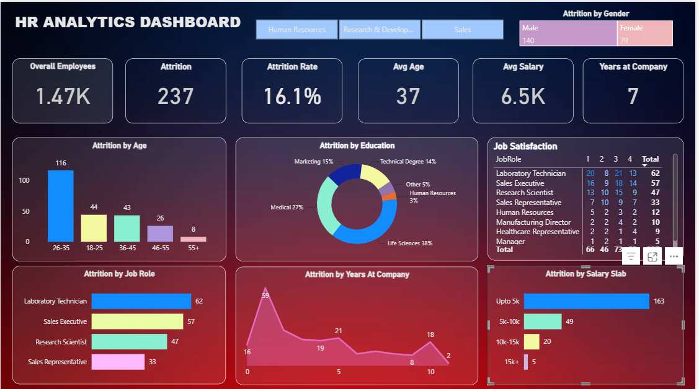

# 📊 HR Analytics Dashboard | Power BI

## 📌 Project Overview

This interactive HR Analytics Dashboard was built in Power BI to analyze employee attrition and identify key workforce trends. The dashboard helps HR teams understand attrition patterns across departments, age groups, education levels, job roles, salary slabs, and years at the company.

---

## 🎯 Objectives

- Analyze employee attrition
- Track key HR KPIs
- Identify high attrition departments
- Understand attrition by age, salary, education, and job role
- Enable interactive filtering using department slicers

---

## 📈 Dashboard KPIs

- 👥 Overall Employees
- 🚪 Attrition Count
- 📉 Attrition Rate
- 🎂 Average Age
- 💰 Average Salary
- 📅 Average Years at Company

---

## 📊 Dashboard Features

- Attrition by Age
- Attrition by Education
- Attrition by Job Role
- Attrition by Salary Slab
- Attrition by Years at Company
- Job Satisfaction Analysis
- Department Filter
- Gender-wise Attrition

---

## 🛠 Tools Used

- Power BI
- Power Query
- DAX
- Data Modeling

---

## 📷 Dashboard Preview

---

## 💡 Key Insights

- Overall Attrition Rate is **16.1%**.
- Employees aged **26–35** show the highest attrition.
- Laboratory Technicians have the highest attrition among all job roles.
- Employees earning **Up to 5K** account for the largest share of attrition.
- Life Sciences has the highest attrition among education backgrounds.

---

## 📂 Dataset

The dataset used for this project is included in the Dataset folder.

---

## ⭐ If you found this project useful, consider giving it a star!
